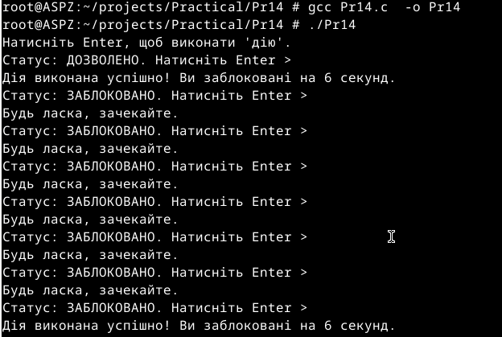

# Практична робота №14
Цей репозиторій cтворений для перегляду виконання практичної роботи №14 з дисципліни "Архітектура системного програмного забезпечення", виконане студентом Щур Р.І., групи ТВ-32.

## Завдання №24
  Створіть систему захисту від DoS: обмежте частоту певних дій користувача через таймери блокування.

## Виконання

Використав таймер SIGALRM, реалізував просту імітацію захисту від DoS. Програма обмежує частоту виконання, дозволяючи її лише раз на 6 секунд. Спроби діяти частіше ігноруються доки таймер блокування не закінчиться.
